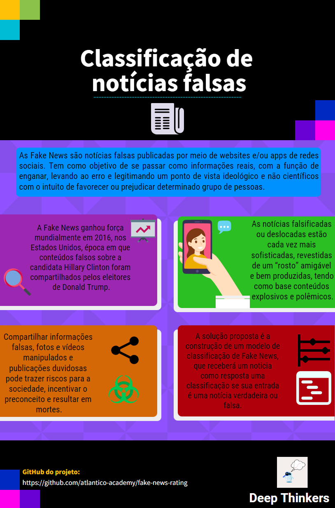

# Classificação de notícias falsas

Os mecanismos de produção e veiculação das falsas informações são muito eficientes e escondem a identidade dos criminosos, mas com a ajuda dos usuários da internet para identificar uma notícia falsa ou com conteúdo duvidoso e tomar a ação de não compartilhar essas informações, obtemos, assim, uma diminuição da disseminação de Fake News. Portanto, nossa proposta é a construção de um modelo de classificação de Fake News, usado como uma ferramenta que permita o acesso de forma simples e intuitiva aos usuários da internet, para que os mesmos possam fazer suas checagens sobre uma determinada notícia, recebendo como resposta uma classificação se sua entrada é uma notícia verdadeira ou falsa. O objetivo é diminuir a propagação das Fake News e conscientizar os usuários.

## Resumo Gráfico

## Desenvolvedores
 - [Amanda da Silva Farias](https://github.com/AmandaFar)
 - [Cristina Toshie Iwassaki](https://github.com/c-Tos1wa)
 - [Carlos Matheus Rodrigues Martins](https://github.com/cmatheusIA)
 - [Antonio Lucas Delerino](https://github.com/delerino)
 - [Douglas da Silva Teixeira](https://github.com/DougTeixeira)
 - [Hosana Fernandes Gomes](https://github.com/hosanafg)
 - [Francisco Rafael de Lima Xaviefr](https://github.com/rafaelxavier-ocn)
 - [Francisco Valderlan Jorge Nobre](https://github.com/valderlan)